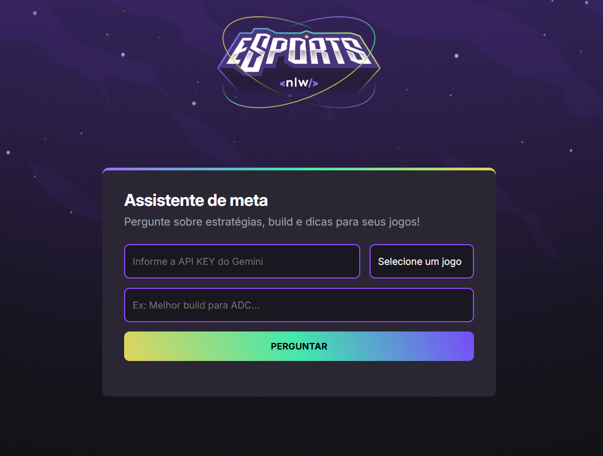

<h1 align="center">Assistente de jogos/meta 🎮</h1>

esse é um assistente inteligente que ajuda jogadores com dicas 
para melhorar em suas jogadas, tirar dúvidas e trazer informações de acordo com o
jogo selecionado.

clique aqui para ver e textar 👉
https://isabellyalvescorrea.github.io/Assistente-de-jogos/

O projeto utiliza a API do Gemini, modelo de linguagem da Google,
para gerar respostas em tempo real com base na pergunta.

# Tecnologias utilizadas

- HTML
- CSS
- JavaScript
- API Gemini
- Vs code
    

# Funcionalidades

- Integração com a API Gemini para geração de texto
- Interface simples e responsiva
- dados atualizados sobre o jogo escolhido, fornecidos pelo Gemini
em tempo real
- respostas diretas e claras

# Estrutura

- index.html = Página principal
- sript.js = Interação e conexão com API
- style.css = Estilização da página principal
- assets = imagens utilizadas
  
(É necessário fornecer uma chave de API key do Gemini para fazer a pergunta)
você pode gerar sua chave rapidamente no https://ai.google.dev/gemini-api/docs?hl=pt-br

Esse projeto foi desenvolvido juntamente com o evento NLW Agents,
promovido pela instituição Rocketseat, para fins de estudo e prática.

